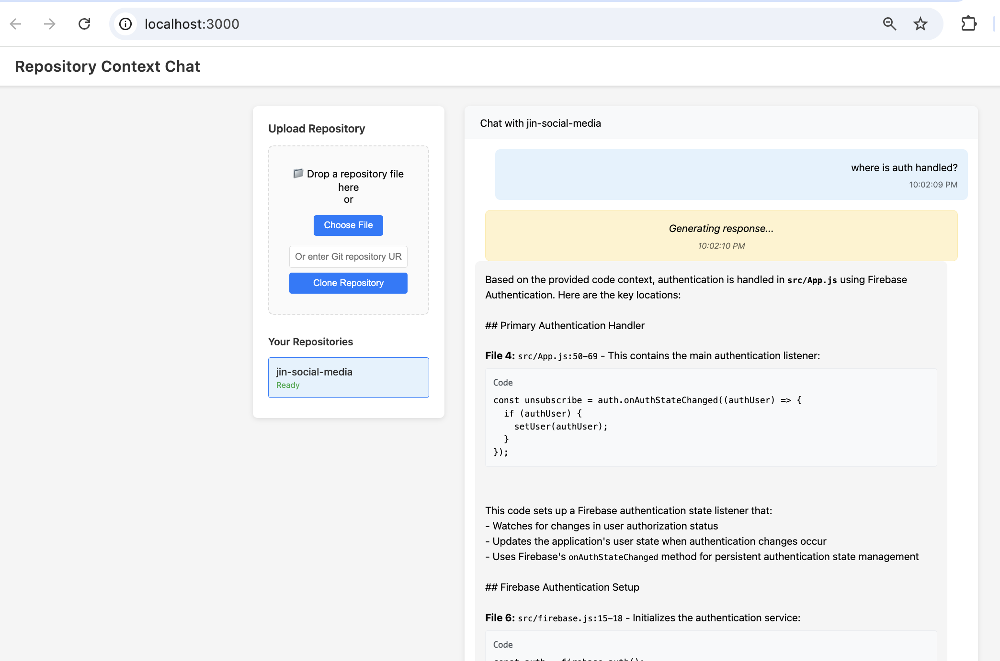

# Repository Context + Coding Agent Service

Go gRPC orchestration and coding agent service where you can upload your repository and get an AI powered chatbot that understsands your code using dual search backends (lexical + semantic) and LLM composition.



## Key Components

### 🔍 Search
- **Ripgrep** – lexical search  
- **Weaviate + OpenAI embeddings** – semantic search  

### 🏗️ APIs & Protocols
- **gRPC** – primary API  
- **HTTP Gateway** – REST compatibility  
- **WebSocket Bridge** – streaming responses  

### 💬 Frontend
- **Web Chat UI** – repository selection & Q&A  
- **Real-time Streaming** – early search hits + progressive LLM output  

### ⚙️ Backend
- **Multi-Repository Management** – query multiple repos at once  
- **Redis** – caching layer  
- **Weaviate** – vector storage  

### 🐳 Deployment
- **Docker Compose** – local development & deployment  
- **Self-contained stack** – no external cloud dependencies required  

### 📊 Monitoring & Observability
- **Prometheus** – metrics collection  
- **Jaeger** – distributed tracing  
- **Grafana** – dashboards & visualization  
## Architecture

```
┌─────────────┐ HTTP  ┌─────────────┐ gRPC ┌─────────────┐
│   Web UI    │──────▶│ HTTP Server │─────▶│ gRPC Server │
│             │ WS    │ (Gateway +  │      │    (Go)     │
│ Upload/Chat │──────▶│  WebSocket) │      │             │
└─────────────┘       └─────────────┘      └─────────────┘
                                                   │
                                   ┌───────────────┼───────────────┐
                                   │               │               │
                          ┌────────▼────┐ ┌───────▼────┐ ┌────────▼─────┐
                          │  Ingestion  │ │Dual Search │ │Chat Service  │
                          │  Pipeline   │ │   Engine   │ │(WebSocket)   │
                          └─────────────┘ └────────────┘ └──────────────┘
                                   │               │               │
                          ┌────────▼────┐ ┌───────▼────┐ ┌────────▼─────┐
                          │   OpenAI    │ │  Weaviate  │ │   DeepSeek   │
                          │ Embeddings  │ │   Vector   │ │     LLM      │
                          │     API     │ │     DB     │ │              │
                          └─────────────┘ └────────────┘ └──────────────┘

                                         ┌─────────────┐ ┌──────────────┐
                                         │    Redis    │ │   ripgrep    │
                                         │    Cache    │ │   (Lexical   │
                                         │             │ │   Search)    │
                                         └─────────────┘ └──────────────┘
```

## 📖 Key files

Once you upload the repository, the gateway triggers gRPC for the ingestion pipeline. When the user searches a query, that starts the dual search engine, composition using Deepseek, and the results from Deepseek is streamed using the Websocket.

Ingestion pipeline divides the repository code into chunks and uses openAI embeddings API to create vectors. This vector is saved to the weaviate DB locally (free since weaviate is open source) and the vectors are later used to handle user queries. 

### System Understanding
1. **[README.md](README.md)** - Project overview, setup, and basic usage
2. **[ARCHITECTURE.md](ARCHITECTURE.md)** - System design, component interactions, concurrency patterns
3. **[INTEGRATION_TESTING.md](INTEGRATION_TESTING.md)** - Complete testing workflow and validation

### Core Implementation
4. **[cmd/apiserver/main.go](cmd/apiserver/main.go)** - Application entry point and dependency injection
5. **[internal/api/websocket.go](internal/api/websocket.go)** - WebSocket↔gRPC bridge (bidirectional streaming)
6. **[internal/api/chat.go](internal/api/chat.go)** - Chat service with dual search implementation
7. **[internal/query/merge.go](internal/query/merge.go)** - Result merging and ranking algorithms

### Specialized Systems
8. **[internal/ingest/inline.go](internal/ingest/inline.go)** - Repository processing pipeline
9. **[SEMANTIC_SEARCH.md](SEMANTIC_SEARCH.md)** - Vector search deep dive with OpenAI + Weaviate
10. **[internal/query/lexical_rg.go](internal/query/lexical_rg.go)** - Ripgrep integration with fuzzy matching
11. **[internal/cache/redis.go](internal/cache/redis.go)** - Multi-layer caching strategy

### Protocol and Configuration
12. **[proto/repocontext/v1/](proto/repocontext/v1/)** - Protocol buffer definitions
13. **[deploy/docker-compose.dev.yml](deploy/docker-compose.dev.yml)** - Service orchestration
14. **[internal/config/config.go](internal/config/config.go)** - Configuration management

### 🎓 Advanced Topics
These below topics are are covered in ARCHITECTURE.md, SEMANTIC_SEARCH.md, and INTEGRATION_TESTING.md
- **Concurrency Patterns**: Focus on WebSocket bridge, dual search coordination, pipeline processing
- **Protocol Translation**: HTTP/WebSocket/gRPC bridges and data transformation
- **Performance Optimization**: Caching strategies, embedding batching, vector search tuning
- **Observability**: Metrics collection, tracing, health checks


## Quick Start

### Prerequisites

- Docker and Docker Compose
- OpenAI API key (for embeddings)
- DeepSeek API key (for chat responses)

### 1. Clone + Configure + Setup

```bash
git clone <repository-url>
cd repo-context-service

# Copy and configure environment
cp .env.example .env
# Edit .env with your API keys

# for first-time development setup. Check Makefile for detail
# Runs the proto, etc
make setup
```

### 2. Set Required Environment Variables

```bash
export OPENAI_API_KEY="your-openai-api-key-here"
export DEEPSEEK_API_KEY="your-deepseek-api-key-here"
```

### 3. Start Services

```bash
# Start all services with Docker Compose
make up
```

This will start:
- **API Server**: localhost:8080 (HTTP), localhost:9090 (gRPC)
- **Web UI**: http://localhost:3000
- **Weaviate**: localhost:8082 (local vector database)
- **Redis**: localhost:6379 (caching layer)
- **Grafana**: http://localhost:3001 (admin/admin)
- **Jaeger**: http://localhost:16686 (tracing)
- **Prometheus**: http://localhost:9091 (metrics)

### 4. Verify Deployment

```bash
# Check API health
curl http://localhost:8080/health

# Check if all services are running
docker ps | grep repo-context

# Open web UI
open http://localhost:3000
```

## Usage

### Web UI (Recommended)

1. **Access UI**: Go to http://localhost:3000

2. **Upload Repository**:
   - **Git URL**: Enter any public GitHub repository URL (e.g., `https://github.com/user/repo`)
   - **File Upload**: Drag and drop ZIP/tar files

3. **Monitor Processing**:
   - Watch progress: PENDING → EXTRACTING → CHUNKING → EMBEDDING → INDEXING → READY
   - Processing time: ~5-15 minutes depending on repository size

4. **Chat with Your Code**:
   - **Select Repository**: Click on a repository in READY state to enable chat
   - **Real-time Streaming**: Type questions and get streaming responses with code context
   - **Example Questions**:
     - "How does authentication work in this codebase?"
     - "Where are the API endpoints defined?"
     - "Show me the database schema and models"
     - "Find all error handling patterns"
     - "Explain the main application architecture"
   - **Advanced Features**:
     - Early search hits using fuzzy matching (ripgrep) while LLM composes response
     - Code citations with file paths and line numbers
     - Dual search combines exact matches + semantic understanding
     - WebSocket streaming for real-time interaction

### API Examples
---
#### Upload a Git Repository

```bash
curl -X POST http://localhost:8080/v1/upload/git \
  -H "Content-Type: application/json" \
  -d '{
    "git_repository": {
      "url": "https://github.com/user/repo.git",
      "ref": "main"
    },
    "tenant_id": "local",
    "idempotency_key": "my-repo-upload-1"
  }'

# Response:
# {
#   "uploadId": "my-repo-upload-1",
#   "repositoryId": "repo-1234567890",
#   "acceptedAt": "2024-01-01T10:00:00Z",
#   "status": {"state": "STATE_PENDING"}
# }
```

#### Check Processing Status

```bash
curl "http://localhost:8080/v1/upload/my-repo-upload-1/status?tenant_id=local"

# Response shows current state:
# - STATE_PENDING: Upload accepted
# - STATE_EXTRACTING: Cloning repository
# - STATE_CHUNKING: Breaking code into chunks
# - STATE_EMBEDDING: Generating embeddings
# - STATE_INDEXING: Storing in Weaviate
# - STATE_READY: Ready for questions
# - STATE_FAILED: Something went wrong
```

#### List Repositories

```bash
curl "http://localhost:8080/v1/repositories?tenant_id=local"
```

#### Chat via WebSocket

The chat functionality uses WebSocket for real-time streaming responses:

```javascript
// Connect to chat WebSocket
const ws = new WebSocket('ws://localhost:3000/v1/chat/{repository_id}/stream');

// Start chat session
ws.send(JSON.stringify({
  start: {
    repository_id: "repo-1234567890",
    tenant_id: "local",
    options: {
      max_results: 10,
      stream_tokens: true
    }
  }
}));

// Send chat message
ws.send(JSON.stringify({
  chat_message: {
    query: "How does authentication work?",
    session_id: "session-123"
  }
}));

// Handle streaming responses
ws.onmessage = (event) => {
  const data = JSON.parse(event.data);

  if (data.search_started) {
    console.log('Search started:', data.search_started.session_id);
  }

  if (data.search_hit) {
    console.log('Search hit:', data.search_hit.chunk.file_path);
  }

  if (data.composition_token) {
    console.log('LLM token:', data.composition_token.text);
  }

  if (data.composition_complete) {
    console.log('Final response:', data.composition_complete.full_response);
  }
};
```

### Computer Memory Requriements For Repository

| Repository Type | Compressed Size | Files | Memory Usage |
|----------------|-----------------|-------|--------------|
| **Small Projects** | Up to 500MB | 1K-5K files | 2-4GB |
| **Large Projects** | 500MB-2GB | 5K-15K files | 4-8GB |
| **Very Large** | 2GB-8GB | 15K+ files | 8-16GB |

**Optimal range**: 1-4GB compressed repositories with 10K-30K files.

## Development

### First-Time Setup

**⚠️ IMPORTANT**: Run this before building:

```bash
# Install tools, dependencies, and generate proto files
make setup

# Then build and run
make build
make run
```

### Available Commands

```bash
make setup         # First-time setup (required)
make build         # Build the binary
make run           # Build and run locally
make up            # Start all services with Docker
make down          # Stop all services
make test          # Run tests
make lint          # Run linters
make fmt           # Format code

# Data Management
./scripts/cleanup.sh # Clean all uploaded repositories, Redis, and Weaviate data
```

### Development Workflow

```bash
# Start services for development
make up

# ⚠️ If you make code changes and they don't appear:
make up-fresh    # Force rebuild with no cache (takes 5-10 min)

# Quick restart (if changes are in Go code only, not Docker config)
make build
docker-compose -f deploy/docker-compose.dev.yml restart apiserver

# View logs
docker-compose -f deploy/docker-compose.dev.yml logs -f apiserver
```

## Configuration

### Environment Variables

| Variable | Description | Required | Default |
|----------|-------------|----------|---------|
| `OPENAI_API_KEY` | OpenAI API key for embeddings | ✅ | - |
| `DEEPSEEK_API_KEY` | DeepSeek API key for chat | ✅ | - |
| `TRACING_ENABLED` | Enable OpenTelemetry tracing | - | `true` |
| `UPLOAD_MAX_FILE_SIZE` | Max upload size in bytes | - | 100MB |
| `DEFAULT_CHUNK_SIZE` | Code chunk size in lines | - | 100 |

### Upload Configuration

- **Supported formats**: .zip, .tar, .tar.gz, .tgz, Git URLs
- **Auto-excluded**: node_modules/, vendor/, .git/, binaries, images, build artifacts
- **Languages supported**: Go, JavaScript, Python, Java, C/C++, Rust, and 20+ more

### Search Configuration

- **Lexical search**: ripgrep with regex support
- **Semantic search**: OpenAI text-embedding-ada-002 via Weaviate
- **Chunk strategy**: 100 lines with 10-line overlap for context
- **Result merging**: Combines and ranks lexical + semantic results

## Monitoring & Observability

### Metrics (Prometheus)

Access at http://localhost:9091:

- `rpc_requests_total` - API request counts by method and status
- `ingestion_duration_seconds` - Repository processing time
- `backend_latency_seconds` - Search performance by backend
- `cache_hits_total` - Redis cache effectiveness

### Tracing (Jaeger)

Access at http://localhost:16686 to view:
- End-to-end request traces
- Search backend performance
- LLM composition timing
- Error propagation

### Dashboards (Grafana)

Access at http://localhost:3001 (admin/admin):
- System overview dashboard
- Search performance metrics
- Repository ingestion stats

## Troubleshooting

### **Most Common Issue: Code Changes Not Appearing**

**Problem**: You make code changes but they don't appear when testing (old behavior persists).

**Cause**: Docker is using cached images with old code.

**Solution**: Use the force rebuild command:
```bash
# 🔄 Force rebuild all Docker images from scratch
make up-fresh
```


### Other Common Issues

**"OPENAI_API_KEY is required" error:**
```bash
# Make sure environment variables are set
export OPENAI_API_KEY="sk-..."
export DEEPSEEK_API_KEY="sk-..."
make up
```

**Repository stuck in "CHUNKING" state:**
- Check API key quota: OpenAI embeddings API limits
- View logs: `docker-compose -f deploy/docker-compose.dev.yml logs -f apiserver`

**How to check if saving to Weaviate was done correctly:**
- Wait for repository processing to complete (STATE_READY)
- Check upload status via API
- Verify Weaviate is running: `curl http://localhost:8082/v1/.well-known/ready`

**Chat interface doesn't enable after repository upload:**
- Ensure repository status is STATE_READY (not PENDING/PROCESSING)
- Check browser console for JavaScript errors
- Verify WebSocket connection: `curl -I -H "Upgrade: websocket" -H "Connection: upgrade" ws://localhost:3000/v1/chat/repo-123/stream`

**WebSocket chat connection fails:**
- Check that the apiserver container is running and healthy
- Verify repository ID exists: `curl "http://localhost:8080/v1/repositories?tenant_id=local"`
- Test WebSocket endpoint is accessible
- Check nginx is properly proxying WebSocket connections

**Chat returns empty or irrelevant responses:**
- Verify repository has completed embedding generation (STATE_READY)
- Check OpenAI API key is valid and has quota
- Try different query phrasing or keywords
- Verify Weaviate collections exist: `curl http://localhost:8082/v1/schema`

### Debug Commands

```bash
# Check all services
docker ps | grep repo-context

# View logs
docker-compose -f deploy/docker-compose.dev.yml logs -f apiserver

# Test git clone manually
docker exec repo-context-apiserver git clone https://github.com/user/repo /tmp/test

# Check Weaviate health and collections
curl http://localhost:8082/v1/.well-known/ready
curl http://localhost:8082/v1/schema

# Test API directly
curl -X POST http://localhost:8080/v1/upload/git \
  -H "Content-Type: application/json" \
  -d '{"git_repository": {"url": "https://github.com/microsoft/vscode"}, "tenant_id": "local"}'

# Test WebSocket chat connection
curl -I -H "Upgrade: websocket" -H "Connection: upgrade" \
  ws://localhost:3000/v1/chat/repo-123/stream

# Check Redis cache
docker exec repo-context-redis redis-cli keys "*"
docker exec repo-context-redis redis-cli get "upload:status:my-upload-id"

# Clean development data
./scripts/cleanup.sh
```

## System Requirements

### Minimum
- **RAM**: 8GB (for small repositories)
- **Storage**: 10GB free space
- **CPU**: 2+ cores
- **Network**: Internet access for API calls

## API Reference

### 📡 HTTP Endpoints (gRPC-Gateway)

| Method | Endpoint | gRPC Service | gRPC Method | Description |
|--------|----------|-------------|-------------|-------------|
| `POST` | `/v1/upload/git` | `UploadService` | `UploadGitRepository` | **🔄 Ingestion Pipeline Entry** |
| `GET` | `/v1/upload/{id}/status?tenant_id=local` | `UploadService` | `GetUploadStatus` | **📊 Monitor Processing Pipeline** |
| `GET` | `/v1/repositories?tenant_id=local` | `RepositoryService` | `ListRepositories` | **📚 Multi-tenant Repository Catalog** |
| `GET` | `/v1/repositories/{id}?tenant_id=local` | `RepositoryService` | `GetRepository` | **🔍 Repository Metadata & Stats** |
| `DELETE` | `/v1/repositories/{id}?tenant_id=local` | `RepositoryService` | `DeleteRepository` | **🗑️ Cleanup Repository & Vectors** |
| `GET` | `/health` | `HealthService` | `Check` | **🏥 System Health & Component Status** |
| `GET` | `/ping` | `HealthService` | `Ping` | **🏓 Simple Connectivity Test** |

### 🔌 WebSocket Endpoints (gRPC Bridge)

| Method | Endpoint | gRPC Service | gRPC Method | Description |
|--------|----------|-------------|-------------|-------------|
| `GET` | `/v1/chat/{repository_id}/stream` | `ChatService` | `ChatWithRepository` | **💬 Real-time Q&A with Dual Search** |

**WebSocket Message Flow:**
1. **Start Session**: `{"start": {"repository_id": "...", "tenant_id": "local", "options": {...}}}`
2. **Send Query**: `{"chat_message": {"query": "...", "session_id": "..."}}`
3. **Stream Response**: Search hits → LLM composition → Final response
4. **Cancel/Close**: `{"cancel": {"session_id": "..."}}`

### 🏗️ gRPC Services (Port 9090)

#### **UploadService** - Repository Ingestion Pipeline
- **`UploadGitRepository`** → HTTP: `POST /v1/upload/git`
- **`GetUploadStatus`** → HTTP: `GET /v1/upload/{id}/status`
- **`UploadRepository`** → gRPC-only (streaming file uploads)

#### **RepositoryService** - Repository Management
- **`ListRepositories`** → HTTP: `GET /v1/repositories`
- **`GetRepository`** → HTTP: `GET /v1/repositories/{id}`
- **`DeleteRepository`** → HTTP: `DELETE /v1/repositories/{id}`

#### **ChatService** - Real-time Q&A System
- **`ChatWithRepository`** → WebSocket: `/v1/chat/{id}/stream` (bidirectional streaming)

#### **HealthService** - System Monitoring
- **`Check`** → HTTP: `GET /health`
- **`Ping`** → HTTP: `GET /ping`

Use `grpcurl` to explore:
```bash
grpcurl -plaintext localhost:9090 list
grpcurl -plaintext localhost:9090 describe repocontext.v1.UploadService
grpcurl -plaintext localhost:9090 describe repocontext.v1.ChatService
```

---

## 🔄 Control Flow Diagrams

### 1. **Repository Ingestion Pipeline**: HTTP → gRPC → Processing

```
HTTP Request: POST /v1/upload/git
    ↓
┌─────────────────────────────────────────────────────────────────┐
│ HTTP Server (cmd/apiserver/main.go:238)                        │
│ • gRPC-Gateway: runtime.NewServeMux()                          │
│ • Route: RegisterUploadServiceHandlerFromEndpoint()            │
└─────────────────┬───────────────────────────────────────────────┘
                  ↓ gRPC Call
┌─────────────────────────────────────────────────────────────────┐
│ gRPC UploadService (internal/api/upload.go:45)                 │
│ • Method: UploadGitRepository()                                 │
│ • Validation: tenant_id, idempotency_key, git_repository       │
│ • Cache Check: Redis idempotency lookup                        │
└─────────────────┬───────────────────────────────────────────────┘
                  ↓ Async Processing
┌─────────────────────────────────────────────────────────────────┐
│ Ingestion Pipeline (internal/ingest/inline.go:89)              │
│ • STATE_PENDING → STATE_EXTRACTING                             │
│   - ProcessGitRepository() → git clone --depth=1               │
│ • STATE_EXTRACTING → STATE_CHUNKING                            │
│   - chunkFiles() → Intelligent language-specific chunking     │
│ • STATE_CHUNKING → STATE_EMBEDDING                             │
│   - OpenAI text-embedding-ada-002 API (batch processing)      │
│ • STATE_EMBEDDING → STATE_INDEXING                             │
│   - Weaviate collection creation & vector storage             │
│ • STATE_INDEXING → STATE_READY                                 │
│   - Redis status update & cache prefill                       │
└─────────────────────────────────────────────────────────────────┘
```

**Function Call Chain:**
1. `cmd/apiserver/main.go:238` → `RegisterUploadServiceHandlerFromEndpoint()`
2. `internal/api/upload.go:45` → `UploadGitRepository()`
3. `internal/api/upload.go:78` → `cache.SetUploadStatus()`
4. `internal/api/upload.go:85` → `ingestProvider.ProcessRepository()` (async)
5. `internal/ingest/inline.go:89` → `ProcessGitRepository()`
6. `internal/ingest/inline.go:156` → `chunkFiles()`
7. `internal/ingest/inline.go:290` → `generateEmbeddings()`
8. `internal/ingest/inline.go:345` → `indexChunks()`

### 2. **Query Pipeline**: WebSocket → gRPC → Dual Search → LLM

```
WebSocket: ws://localhost:3000/v1/chat/{repo_id}/stream
    ↓
┌─────────────────────────────────────────────────────────────────┐
│ WebSocket Bridge (internal/api/websocket.go:89)                │
│ • Connection Management: Gorilla WebSocket                     │
│ • Protocol Translation: JSON ↔ Protobuf                       │
│ • Route: /v1/chat/{repository_id}/stream                       │
└─────────────────┬───────────────────────────────────────────────┘
                  ↓ gRPC Stream
┌─────────────────────────────────────────────────────────────────┐
│ gRPC ChatService (internal/api/chat.go:89)                     │
│ • Method: ChatWithRepository() - Bidirectional Streaming       │
│ • Session Management: concurrent goroutine per connection      │
│ • Message Types: ChatStart, ChatMessage, ChatCancel            │
└─────────────────┬───────────────────────────────────────────────┘
                  ↓ Parallel Search
┌─────────────────────────────────────────────────────────────────┐
│ Dual Search Engine (internal/api/chat.go:245)                  │
│                                                                 │
│ ┌─────────────────────┐    ┌─────────────────────────────────┐ │
│ │ Lexical Search      │    │ Semantic Search                 │ │
│ │ (ripgrep)           │    │ (Weaviate + OpenAI)            │ │
│ │                     │    │                                 │ │
│ │ • ripgrep -i regex  │    │ • generateQueryEmbedding()      │ │
│ │ • File filtering    │    │ • Weaviate nearText query       │ │
│ │ • Fuzzy matching    │    │ • Vector similarity search     │ │
│ │ • Context lines     │    │ • Cosine distance ranking      │ │
│ └─────────────────────┘    └─────────────────────────────────┘ │
│           ↓                             ↓                      │
│ ┌─────────────────────────────────────────────────────────────┐ │
│ │ Result Merger (internal/query/merge.go:45)                 │ │
│ │ • Combine lexical + semantic results                       │ │
│ │ • Score normalization & ranking                            │ │
│ │ • Deduplication by file path + line range                  │ │
│ │ • Early hit streaming (EARLY phase)                        │ │
│ └─────────────────────────────────────────────────────────────┘ │
└─────────────────┬───────────────────────────────────────────────┘
                  ↓ LLM Composition
┌─────────────────────────────────────────────────────────────────┐
│ DeepSeek LLM Composition (internal/composer/deepseek.go)    │
│ • Context Assembly: Top-ranked code chunks                     │
│ • Prompt Engineering: Query + code context + instructions      │
│ • Token Streaming: Real-time response generation               │
│ • Citation Generation: File paths + line numbers               │
└─────────────────┬───────────────────────────────────────────────┘
                  ↓ Response Stream
┌─────────────────────────────────────────────────────────────────┐
│ Streaming Response Pipeline                                     │
│ 1. search_started    → Query acknowledgment                     │
│ 2. search_hit        → Early search results (EARLY phase)      │
│ 3. composition_started → LLM context summary                    │
│ 4. composition_token   → Real-time token streaming              │
│ 5. composition_complete → Final response with citations         │
│ 6. complete           → Session cleanup                         │
└─────────────────────────────────────────────────────────────────┘
```

**Function Call Chain:**
1. `internal/api/websocket.go:89` → `handleWebSocketConnection()`
2. `internal/api/websocket.go:156` → `ChatWithRepository()` (gRPC stream)
3. `internal/api/chat.go:89` → `ChatWithRepository()`
4. `internal/api/chat.go:245` → `performDualSearch()` (parallel goroutines)
5. `internal/query/lexical_rg.go:55` → `SearchLexical()` (ripgrep)
6. `internal/query/semantic_weaviate.go:67` → `SearchSemantic()` (Weaviate)
7. `internal/query/merge.go:45` → `MergeResults()`
8. `internal/composer/deepseek.go:78` → `ComposeResponse()` (streaming)

### 3. **Key gRPC ↔ Implementation Mappings**

| **HTTP Route** | **gRPC Service.Method** | **Implementation File** | **Core Function** |
|---------------|------------------------|------------------------|------------------|
| `POST /v1/upload/git` | `UploadService.UploadGitRepository` | `internal/api/upload.go` | `UploadGitRepository()` |
| `GET /v1/upload/{id}/status` | `UploadService.GetUploadStatus` | `internal/api/upload.go` | `GetUploadStatus()` |
| `GET /v1/repositories` | `RepositoryService.ListRepositories` | `internal/api/repository.go` | `ListRepositories()` |
| `GET /v1/repositories/{id}` | `RepositoryService.GetRepository` | `internal/api/repository.go` | `GetRepository()` |
| `DELETE /v1/repositories/{id}` | `RepositoryService.DeleteRepository` | `internal/api/repository.go` | `DeleteRepository()` |
| `GET /health` | `HealthService.Check` | `internal/api/health.go` | `Check()` |
| `ws://.../v1/chat/{id}/stream` | `ChatService.ChatWithRepository` | `internal/api/chat.go` + `websocket.go` | `ChatWithRepository()` |

## Deployment Notes

### Docker Images
- **Base**: Alpine Linux with Git, ripgrep, and Go runtime
- **Size**: ~100MB compressed
- **Security**: Runs as non-root user
